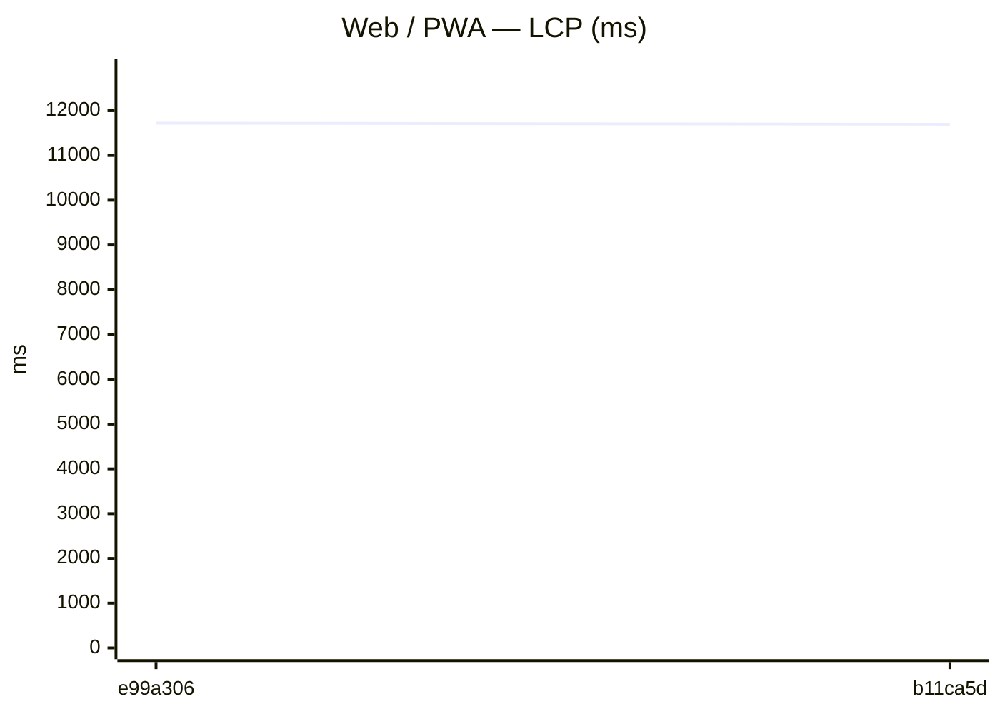
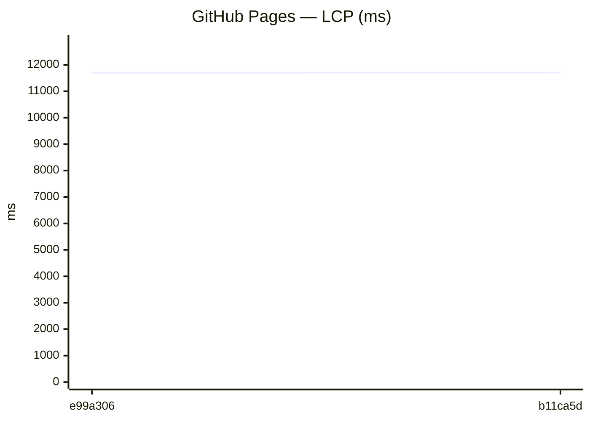
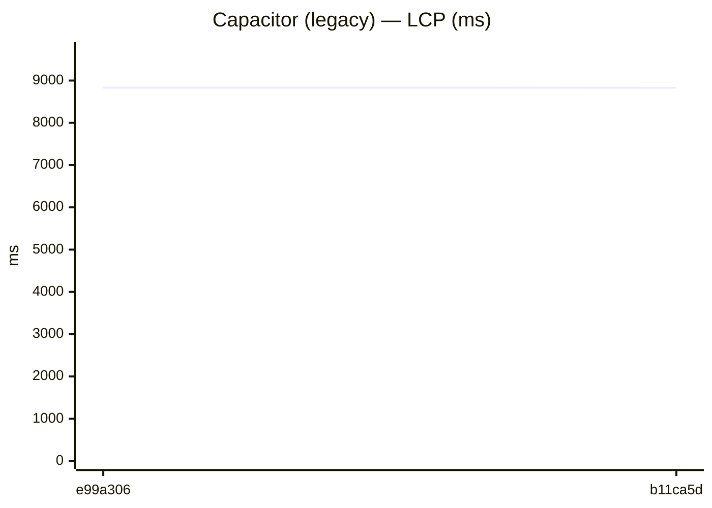
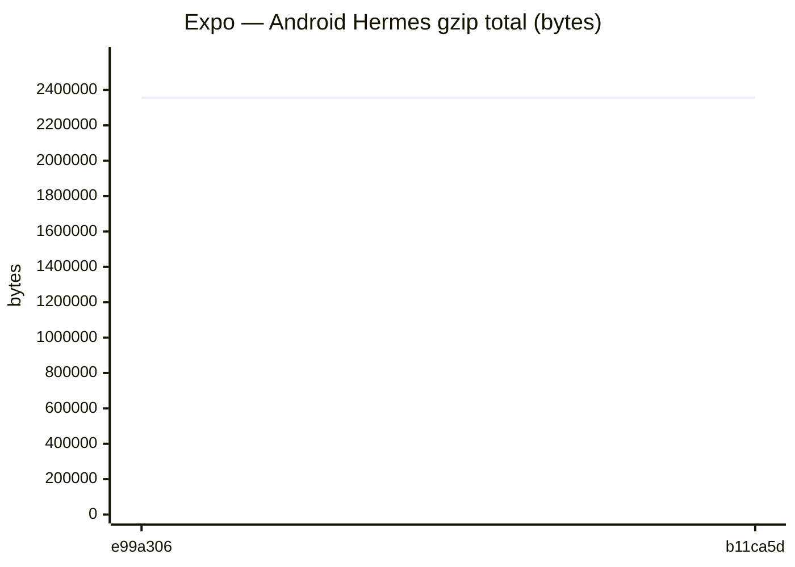
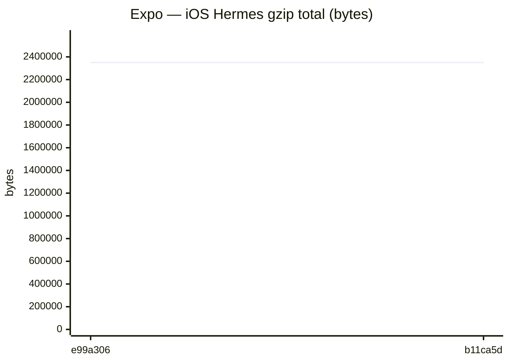

# Benchmark comparison (history)

Generated at **2026-03-29T15:38:32.225Z**.

To change the default number of runs in the primary sections below, edit **[compare.config.json](./compare.config.json)** (`window`). GitHub does not support interactive dropdowns in Markdown; optional **collapsed sections** list alternate window sizes.

---

### Web / PWA

| date | sha | status | LCP_ms | FCP_ms | TBT_ms | run |
| --- | --- | --- | --- | --- | --- | --- |
| 2026-03-29 15:37:19 | e99a306 | ok | 11722 | 10139 | 68 | 23712530867 |
| 2026-03-29 12:06:23 | b11ca5d | ok | 11697 | 10123 | 68 | 23708607059 |


```mermaid
xychart-beta
    title "Web / PWA — TBT (ms)"
    x-axis ["e99a306", "b11ca5d"]
    y-axis "ms" 0 --> 75
    line [68, 68]
```

### GitHub Pages

| date | sha | status | LCP_ms | FCP_ms | TBT_ms | run |
| --- | --- | --- | --- | --- | --- | --- |
| 2026-03-29 15:37:45 | e99a306 | ok | 11701 | 10138 | 60 | 23712530867 |
| 2026-03-29 12:06:49 | b11ca5d | ok | 11707 | 10124 | 54 | 23708607059 |


```mermaid
xychart-beta
    title "GitHub Pages — TBT (ms)"
    x-axis ["e99a306", "b11ca5d"]
    y-axis "ms" 0 --> 66
    line [60, 54]
```

### Capacitor (legacy)

| date | sha | status | LCP_ms | FCP_ms | TBT_ms | run |
| --- | --- | --- | --- | --- | --- | --- |
| 2026-03-29 15:38:10 | e99a306 | ok | 8833 | 7484 | 32 | 23712530867 |
| 2026-03-29 12:07:15 | b11ca5d | ok | 8830 | 7408 | 27 | 23708607059 |


```mermaid
xychart-beta
    title "Capacitor (legacy) — TBT (ms)"
    x-axis ["e99a306", "b11ca5d"]
    y-axis "ms" 0 --> 36
    line [32, 27]
```

### Expo / RN bundles

Aggregates: **sum of gzip bytes** across all `.hbc` files per platform (stable for trends when chunk hashes change).

| date | sha | status | android_gzip | ios_gzip | run |
| --- | --- | --- | --- | --- | --- |
| 2026-03-29 15:37:54 | e99a306 | ok | 2356302 | 2349869 | 23712530867 |
| 2026-03-29 12:06:38 | b11ca5d | ok | 2356299 | 2349865 | 23708607059 |




<details>
<summary>Last <strong>5</strong> runs (all platforms)</summary>

### Web / PWA

| date | sha | status | LCP_ms | FCP_ms | TBT_ms | run |
| --- | --- | --- | --- | --- | --- | --- |
| 2026-03-29 15:37:19 | e99a306 | ok | 11722 | 10139 | 68 | 23712530867 |
| 2026-03-29 12:06:23 | b11ca5d | ok | 11697 | 10123 | 68 | 23708607059 |


```mermaid
xychart-beta
    title "Web / PWA — TBT (ms)"
    x-axis ["e99a306", "b11ca5d"]
    y-axis "ms" 0 --> 75
    line [68, 68]
```

### GitHub Pages

| date | sha | status | LCP_ms | FCP_ms | TBT_ms | run |
| --- | --- | --- | --- | --- | --- | --- |
| 2026-03-29 15:37:45 | e99a306 | ok | 11701 | 10138 | 60 | 23712530867 |
| 2026-03-29 12:06:49 | b11ca5d | ok | 11707 | 10124 | 54 | 23708607059 |


```mermaid
xychart-beta
    title "GitHub Pages — TBT (ms)"
    x-axis ["e99a306", "b11ca5d"]
    y-axis "ms" 0 --> 66
    line [60, 54]
```

### Capacitor (legacy)

| date | sha | status | LCP_ms | FCP_ms | TBT_ms | run |
| --- | --- | --- | --- | --- | --- | --- |
| 2026-03-29 15:38:10 | e99a306 | ok | 8833 | 7484 | 32 | 23712530867 |
| 2026-03-29 12:07:15 | b11ca5d | ok | 8830 | 7408 | 27 | 23708607059 |


```mermaid
xychart-beta
    title "Capacitor (legacy) — TBT (ms)"
    x-axis ["e99a306", "b11ca5d"]
    y-axis "ms" 0 --> 36
    line [32, 27]
```

### Expo / RN bundles

Aggregates: **sum of gzip bytes** across all `.hbc` files per platform (stable for trends when chunk hashes change).

| date | sha | status | android_gzip | ios_gzip | run |
| --- | --- | --- | --- | --- | --- |
| 2026-03-29 15:37:54 | e99a306 | ok | 2356302 | 2349869 | 23712530867 |
| 2026-03-29 12:06:38 | b11ca5d | ok | 2356299 | 2349865 | 23708607059 |


</details>

<details>
<summary>Last <strong>20</strong> runs (all platforms)</summary>

### Web / PWA

| date | sha | status | LCP_ms | FCP_ms | TBT_ms | run |
| --- | --- | --- | --- | --- | --- | --- |
| 2026-03-29 15:37:19 | e99a306 | ok | 11722 | 10139 | 68 | 23712530867 |
| 2026-03-29 12:06:23 | b11ca5d | ok | 11697 | 10123 | 68 | 23708607059 |


```mermaid
xychart-beta
    title "Web / PWA — TBT (ms)"
    x-axis ["e99a306", "b11ca5d"]
    y-axis "ms" 0 --> 75
    line [68, 68]
```

### GitHub Pages

| date | sha | status | LCP_ms | FCP_ms | TBT_ms | run |
| --- | --- | --- | --- | --- | --- | --- |
| 2026-03-29 15:37:45 | e99a306 | ok | 11701 | 10138 | 60 | 23712530867 |
| 2026-03-29 12:06:49 | b11ca5d | ok | 11707 | 10124 | 54 | 23708607059 |


```mermaid
xychart-beta
    title "GitHub Pages — TBT (ms)"
    x-axis ["e99a306", "b11ca5d"]
    y-axis "ms" 0 --> 66
    line [60, 54]
```

### Capacitor (legacy)

| date | sha | status | LCP_ms | FCP_ms | TBT_ms | run |
| --- | --- | --- | --- | --- | --- | --- |
| 2026-03-29 15:38:10 | e99a306 | ok | 8833 | 7484 | 32 | 23712530867 |
| 2026-03-29 12:07:15 | b11ca5d | ok | 8830 | 7408 | 27 | 23708607059 |

```mermaid
xychart-beta
    title "Capacitor (legacy) — LCP (ms)"
    x-axis ["e99a306", "b11ca5d"]
    y-axis "ms" 0 --> 9717
    line [8833, 8830]
```
```mermaid
xychart-beta
    title "Capacitor (legacy) — TBT (ms)"
    x-axis ["e99a306", "b11ca5d"]
    y-axis "ms" 0 --> 36
    line [32, 27]
```

### Expo / RN bundles

Aggregates: **sum of gzip bytes** across all `.hbc` files per platform (stable for trends when chunk hashes change).

| date | sha | status | android_gzip | ios_gzip | run |
| --- | --- | --- | --- | --- | --- |
| 2026-03-29 15:37:54 | e99a306 | ok | 2356302 | 2349869 | 23712530867 |
| 2026-03-29 12:06:38 | b11ca5d | ok | 2356299 | 2349865 | 23708607059 |

```mermaid
xychart-beta
    title "Expo — Android Hermes gzip total (bytes)"
    x-axis ["e99a306", "b11ca5d"]
    y-axis "bytes" 0 --> 2591933
    line [2356302, 2356299]
```
```mermaid
xychart-beta
    title "Expo — iOS Hermes gzip total (bytes)"
    x-axis ["e99a306", "b11ca5d"]
    y-axis "bytes" 0 --> 2584856
    line [2349869, 2349865]
```

</details>

